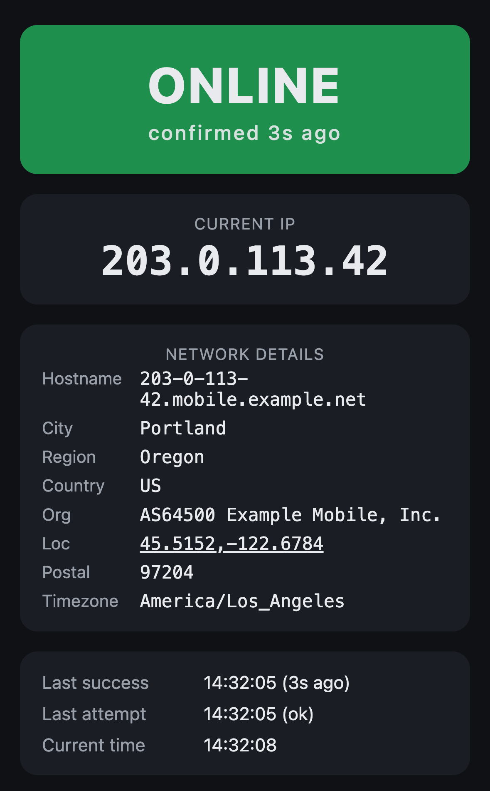

# ip-info

Static page showing your public IP and whether your connection actually works.
Built for checking a phone's mobile data at a glance.

Live: https://ip.pgrs.net



## How it works

Everything is in `index.html` (inline CSS and vanilla JS, no build, no
dependencies).

- Probes `api.ipify.org` every 10s. Status is ONLINE only if the last probe
  succeeded within `STALE_AFTER`; otherwise OFFLINE. A 200 without an `ip`
  string counts as a failure.
- Fetches details from `ipinfo.io/<ip>/json` only when the IP changes (retried on
  the next probe if it fails). Details errors never affect status.
- On tab resume or stalled polling, shows CHECKING… and reprobes instead of
  flashing OFFLINE. Probes that span a suspension are discarded.
- On failure, shows the error category and a hint.

Constants at the top of the `<script>`: `POLL_MS`, `TICK_MS`, `TIMEOUT_MS`,
`STALE_AFTER`. Keep `STALE_AFTER > POLL_MS + TIMEOUT_MS` or ONLINE blips between
polls.

## Gotchas

- **ipinfo allows 1,000 unauthenticated requests/day per public IP**, shared by
  everyone behind a carrier's CGNAT. Don't put it back on the poll loop.
- **Query ipinfo by IP, not `ipinfo.io/json`.** After a network change, a reused
  keep-alive connection can report the previous network.
- **ipinfo's 429 has no CORS header**, so the browser surfaces it as a generic
  `TypeError` and the body is unreadable. The `e.apiError` branch only works
  with a token (`?token=...`) or if ipinfo adds CORS to errors.
- **A blocked request looks the same as an outage.** There's no fallback probe,
  so if ipify is blocked the page reads OFFLINE.
- The 1s tick rewrites only the banner and times. The IP and error card change
  only when their content does, so text selection and taps aren't disrupted.

## Development

```sh
npm install
npm run check   # Biome format + lint
npm run fix     # apply fixes
```

Regenerate the iOS touch icon after editing `icon.svg`:

```sh
magick -background black -density 72 icon.svg -resize 180x180 -strip PNG24:apple-touch-icon.png
```

## Deployment

`.github/workflows/pages.yml` runs `biome ci` on PRs and pushes, then deploys the
repo root to GitHub Pages on pushes to `main`.
